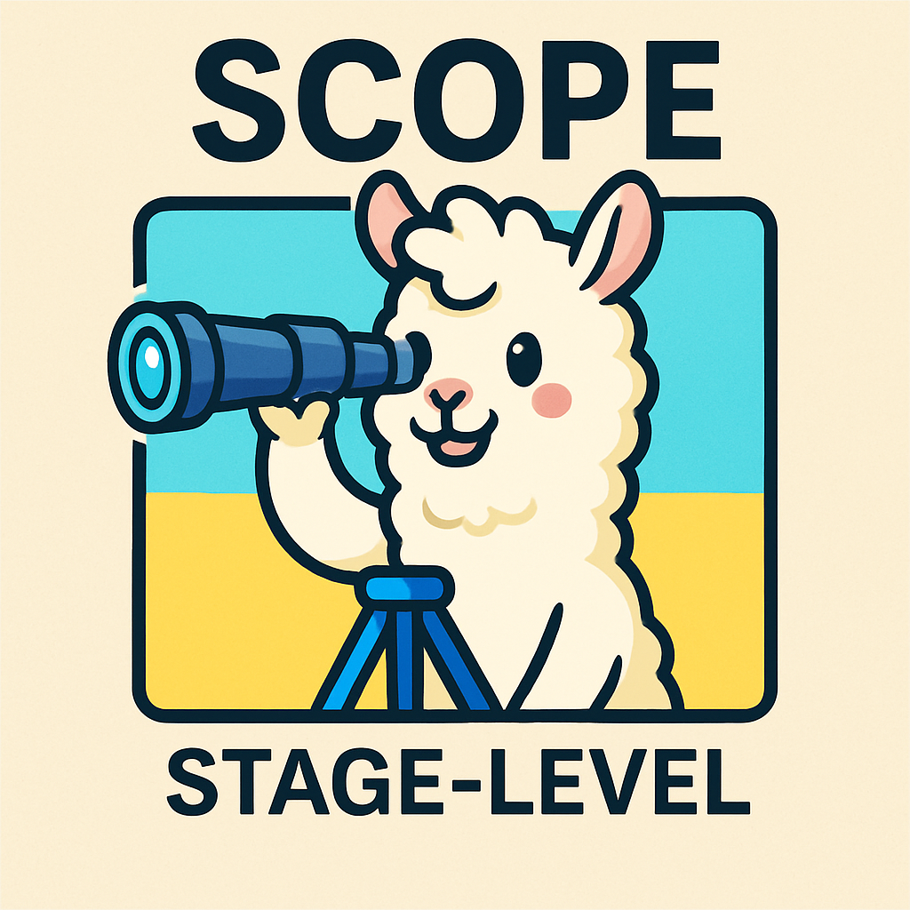
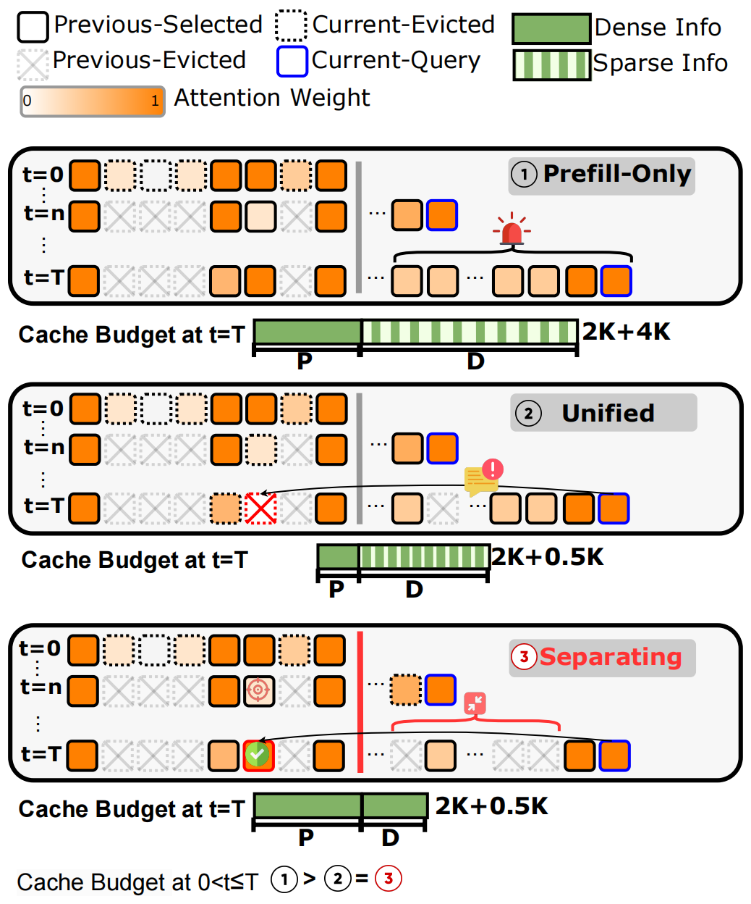
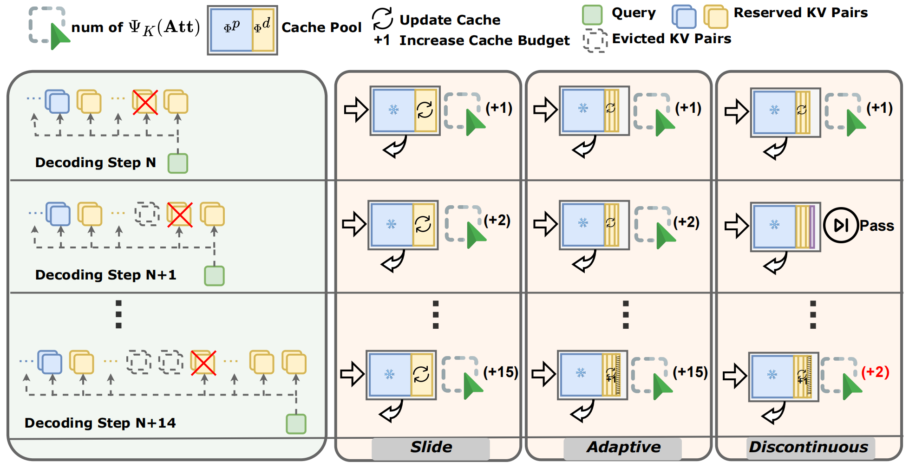
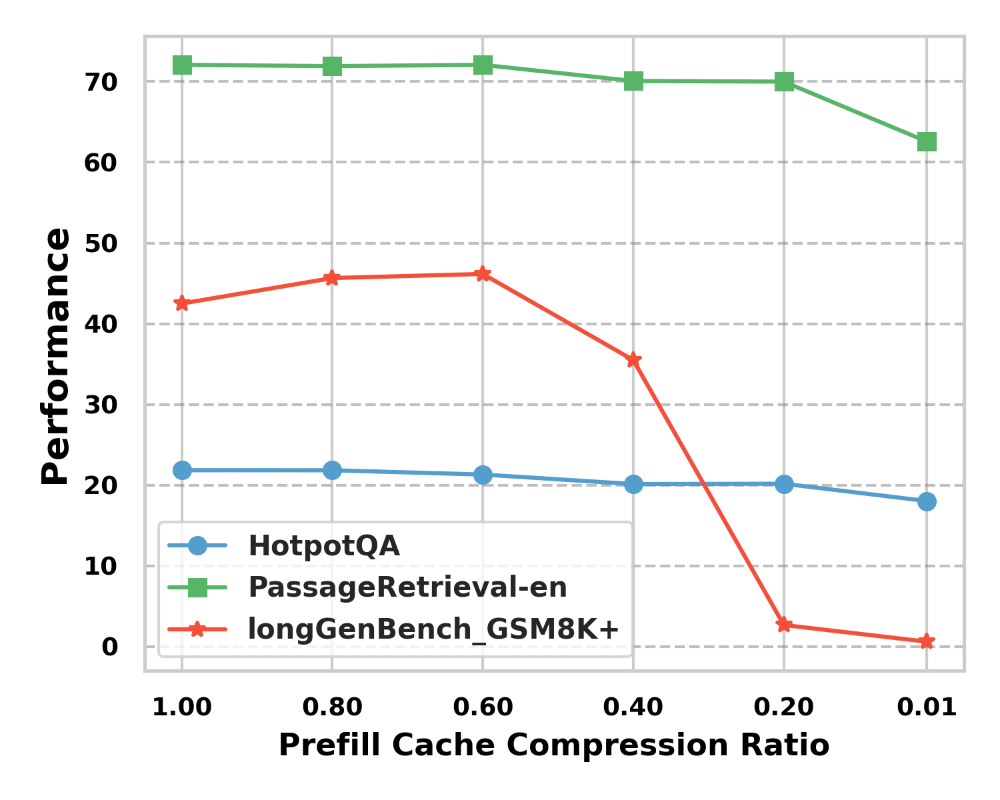
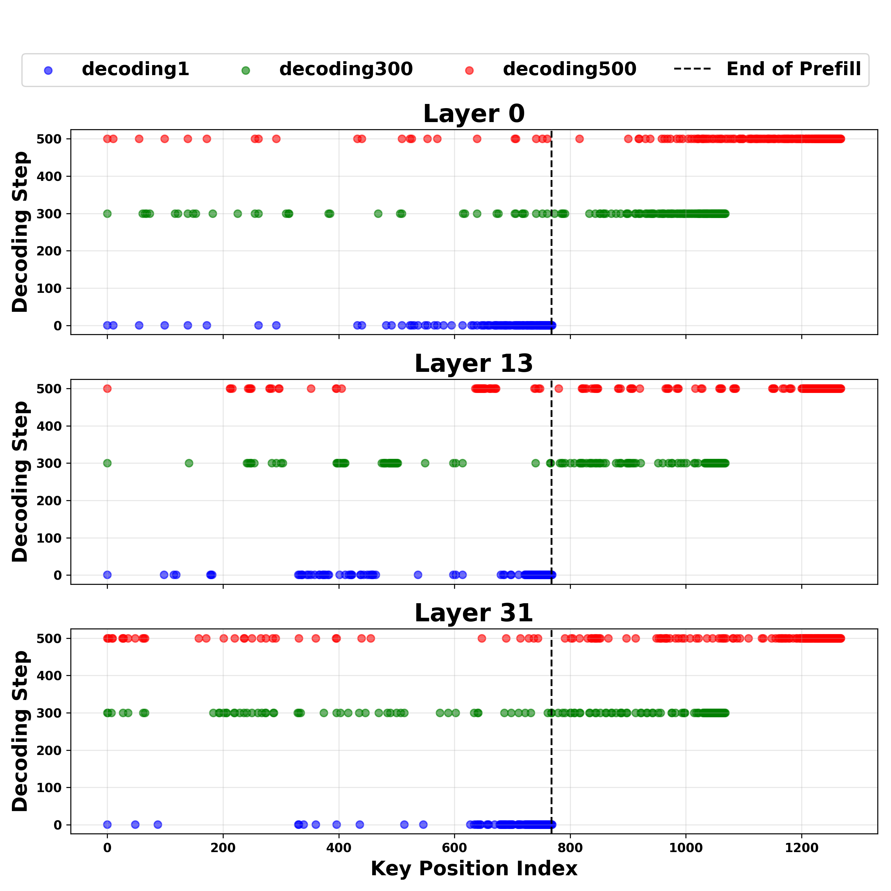
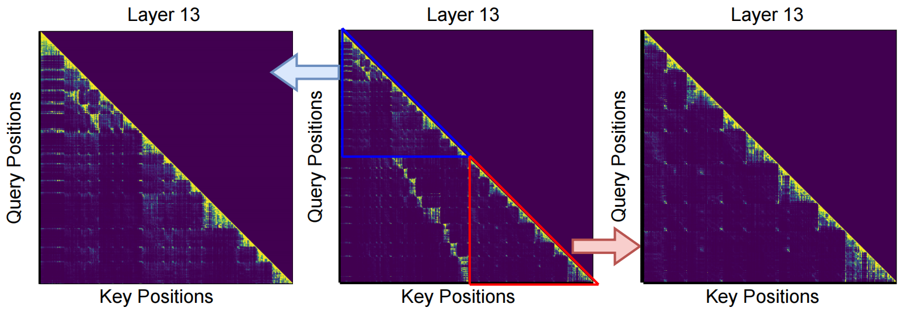
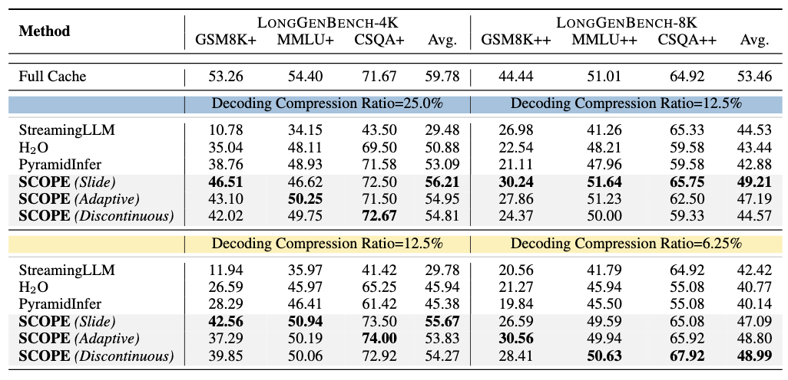
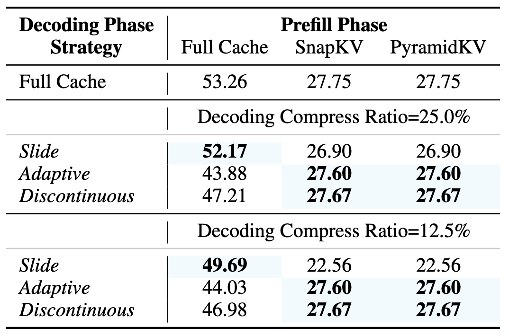

<div align="center">
 <br>
</div>

<h2 align="center"><a href="https://arxiv.org/pdf/2412.13649">SCOPE: Optimizing Key-Value Cache Compression in Long-context Generation</a></h2>

> *<sup>1</sup>Southeast University, <sup>2</sup>King’s College London, <sup>3</sup>The Alan Turing Institute*

<h5 align="center"> If you find our project helpful, please give us a star ⭐ on GitHub to stay updated.</h5>


<h5 align=center>

[](https://github.com/huggingface/transformers)
[](https://arxiv.org/pdf/2412.13649)
[](https://github.com/Linking-ai/SCOPE/blob/main/LICENSE)
</h5>


## Overview

**SCOPE** is a simple yet effective framework designed to tackle the **KV cache bottleneck** in large language models (LLMs) during long-context generation. While existing methods primarily focus on the **prefill phase**, SCOPE introduces **stage-level KV cache compression**, addressing both **prefill and decoding phases** separately—an essential improvement for long-output reasoning tasks.

> SCOPE is especially useful for LLM applications that require **efficient, scalable generation with long outputs**.

<table>
  <tr>
    <td align="center">
      <br/>
      <b>Comparison of Three Paradigms</b>
    </td>
    <td align="center">
      <br/>
      <b>Overview of Three Decoding Strategies</b>
    </td>
  </tr>
</table>

## Key Observations
- **Excessive compression** during the prefill phase
which requires specific full context, impairs the
comprehension of the reasoning task.

- **Deviation of heavy hitters** occurs in the reasoning
tasks with long outputs.


<table>
  <tr>
    <td align="center">
      <br/>
      <b>Excessive compression</b>
    </td>
    <td align="center">
      <br/>
      <b>Deviation of heavy hitters</b>
    </td>
  </tr>
</table>

> We provide a notebook `vis_topk_index_attn.ipynb` to reproduce the *Deviation of heavy hitters* result(1× A100 (80GB) GPU).


## Visualization

Attention heatmaps for layer 13 of a simplified GSM8k+ sample
in LongGenBench:

<p align="center">
     <br>
</p>

> We provide a notebook `vis_attn_map.ipynb` to reproduce the visualization result(1× A100 (80GB) GPU). Model attention maps for different layers would be stored at `./attention_map`.


## Requirements
```
torch==2.4.0
transformers==4.44.2
flash_attn==2.5.8
```

## Environment Setup
```
conda create -n SCOPE
pip install -r requirements.txt
```

## LongGenBench
### Dataset Construction
Our dataset construction method is based on the original [LongGenBench](https://github.com/Dominic789654/LongGenBench) repository. We provide scripts for building the LongGenBench dataset as follows:
- **LongGenBench-4K**

  | Dataset  | Script |
  |----------|--------|
  | GSM8K+   | `create_gsm8k_30.sh` |
  | MMLU+    | `create_mmlu_30.sh` |
  | CSQA+    | `create_csqa_40.sh` |

- **LongGenBench-8K**

  | Dataset  | Script |
  |----------|--------|
  | GSM8K++   | `create_gsm8k_60.sh` |
  | MMLU++    | `create_mmlu_60.sh` |
  | CSQA++    | `create_csqa_80.sh` |

- **Example Usage**
  
  To generate the GSM8K+ dataset, run:
  ```python
  bash scripts/scripts_longgenbench/create_gsm8k_30.sh
  ```

### Inference in LongGenBench

```bash
export CUDA_VISIBLE_DEVICES=$1

method=$2 # Support ALLKV, PyramidKV, PyramidInfer SnapKV, H2O, StreamingLLM
max_capacity_prompts=$3
attn_implementation=$4 # Support "flash_attention_2", "sdpa", "eager".
source_path=$5
model_path=$6
decoding_metric=$7 # H2O Support None,h2o,(slide, adaptive, discontinuous)---SCOPE
decoding_window_size=$8
save_dir=$9 # path to result save_dir
K=$10 #30,60
T=$11

python3 run_longgenbench.py \
    --method ${method} \
    --model_path ${model_path} \
    --max_capacity_prompts ${max_capacity_prompts} \
    --attn_implementation ${attn_implementation} \
    --save_dir ${save_dir} \
    --use_cache True \
    --K ${K}\
    --decoding_window_size ${decoding_window_size} \
    --decoding_recent_size ${decoding_recent_size} \
    --decoding_metric ${decoding_metric} \
    --max_num_examples ${T} \
```

### Eval Acc

```bash
results_dir=$1

python3 eval_gen.py \
    --results_dir ${results_dir}
```

### Performence in LongGenBench (Llama3.1-8B-Instruct)

<p align="center">
     <br>
</p>

The run scripts (bash files) for these experiments are located in the `scripts/scripts_longgenbench` folder, and the experimental results can be found in `results_longgenbench_4K` and `results_longgenbench_8K`.

### Performence on the GSM8K+ task from LONGGENBENCH-4K (Llama3.1-8B-Instruct)

The plug-in experiment results of LLaMA3.1-8B-instruct on the GSM8K+ task from LONGGENBENCH-4K.

<p align="center">
     <br>
</p>

The run scripts (bash files) for these experiments are located in the `scripts/scripts_longgenbench` folder, and the experimental results can be found in `results_longgenbench_gsm8k_plug_in`.


## TODO

- [X] fix offset bug
- [ ] improve README(expand documentation, add examples, and ensure clarity)
- [ ] reorgnize the code for better using experience

## Citation

#### If you find our work valuable, we would appreciate your citation: 🎈

```bibtex
@article{wu2024scope,
  title={SCOPE: Optimizing Key-Value Cache Compression in Long-context Generation},
  author={Wu, Jialong and Wang, Zhenglin and Zhang, Linhai and Lai, Yilong and He, Yulan and Zhou, Deyu},
  journal={arXiv preprint arXiv:2412.13649},
  year={2024}
}
```

## Acknowledgements
- Thanks to [SnapKV](https://github.com/FasterDecoding/SnapKV) and [PyramidKV (KVCache-Factory](https://github.com/Zefan-Cai/KVCache-Factory) for providing open-source code to support the expansion of this project. 🎁

- Special thanks to [LOOK-M](https://github.com/SUSTechBruce/LOOK-M) for the beautifully designed README template, which we referenced. 🎨

- Shoutout to [@Lueci4er](https://github.com/Lueci4er) on GitHub for valuable suggestions on code details, which we adopted. 🛠️


#### The code is still being organized.🚧